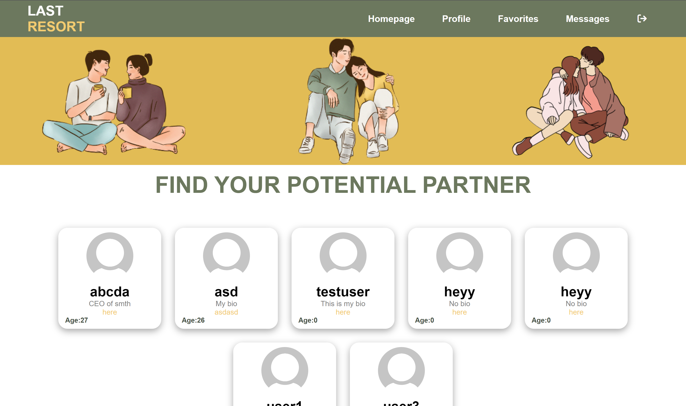
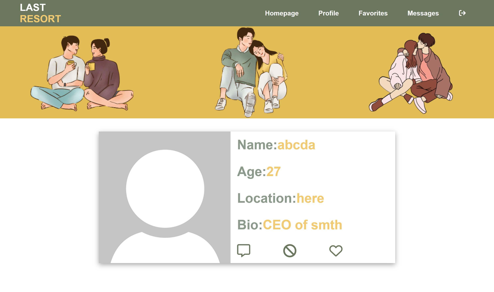
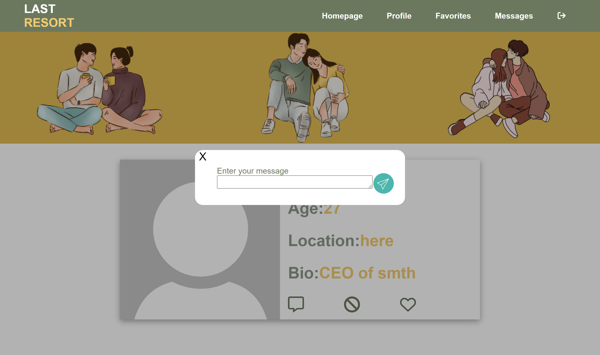

# Dating website

This project implements a dating website using Vanilla HTML, CSS, JS, and Laravel, having the following features:

* On Signup, users choose their gender and which gender they are interested in. They also specify their location (Bonus: Get programarically the location of the user)
* Users can only surf people who are interested in.
* After logging in, users are displayed and sorted by their location.
* Users shall be able to upload a picture, bio, age, etc.
* Users shall be able to favorite others. Favorite users are displayed in a seperate page.
* Users shall be able to block others. Blocked users should not appear anywhere
* Users shall be able to chat with one another

This project was not completed and is missing features

# Screenshots of the present pages

